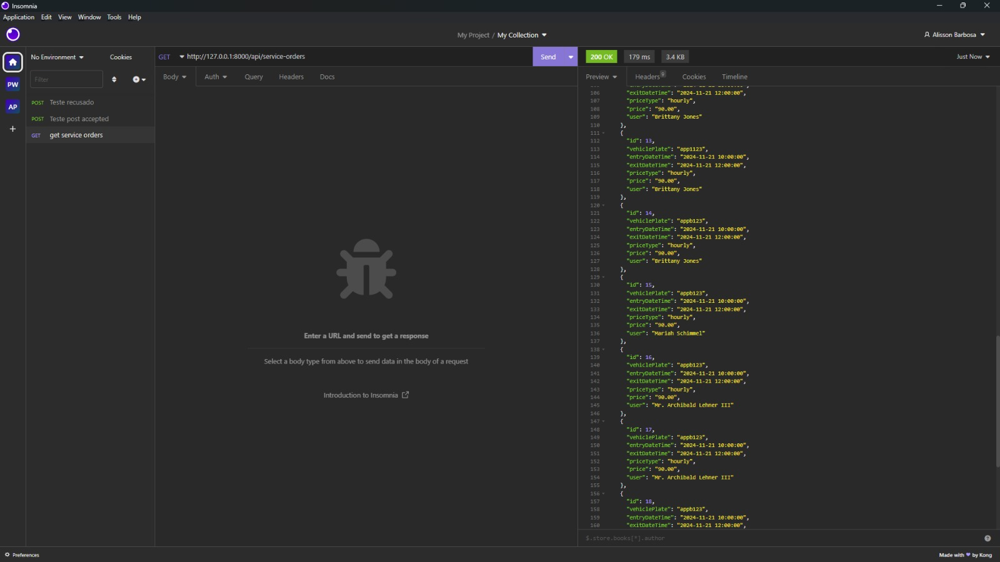
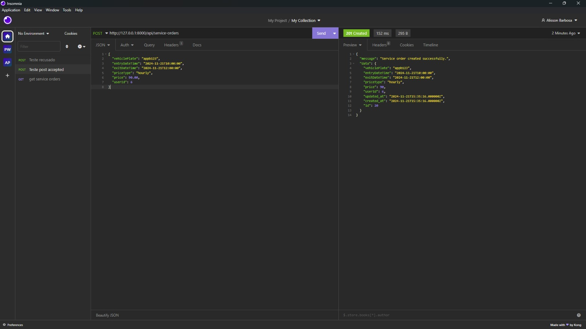
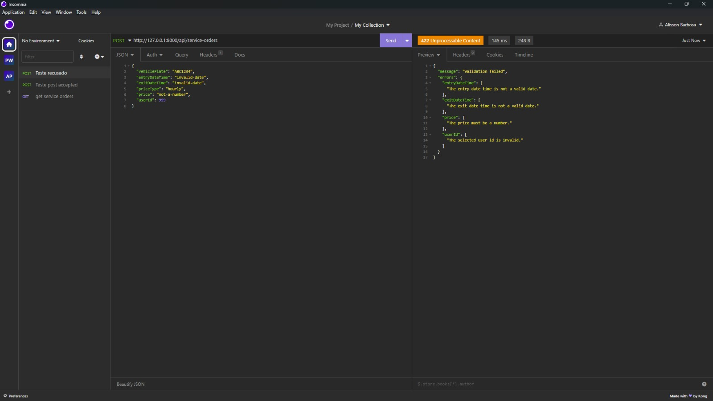

# CRUD de Usuários em PHP/Laravel/Pest

Este projeto é um **CRUD** simples para gerenciar usuários/serviços, utilizando **PHP** com o framework **Laravel**. A aplicação permite apenas adicionar e listar, conforme descrito no teste. O código segue as boas práticas de desenvolvimento com Laravel, incluindo o uso de rotas, controladores, validação e testes -./vendor/bin/pest tests/Feature/UsersControllerTest.php-.

## Tecnologias Utilizadas

- **PHP**: Linguagem de programação.
- **Laravel**: Framework PHP para desenvolvimento web.
- **MySql**: Banco de dados relacional.
- **Pest**: Framework de testes, foi testado todos os methods da classe devusers. 
- **Composer**: Gerenciador de dependências PHP.

## Funcionalidades

- **Listar Serviços**: Exibe todos os usuários cadastrados.
- **Cadastrar Serviços**: Permite adicionar novos usuários com nome e função.

## Instruções para rodar o projeto

Siga os passos:

```bash
git clone https://github.com/AlissonDevPort/API-PHP.git
cd nome-do-repositorio
composer install
php artisan migrate --seed
php artisan serve
```



